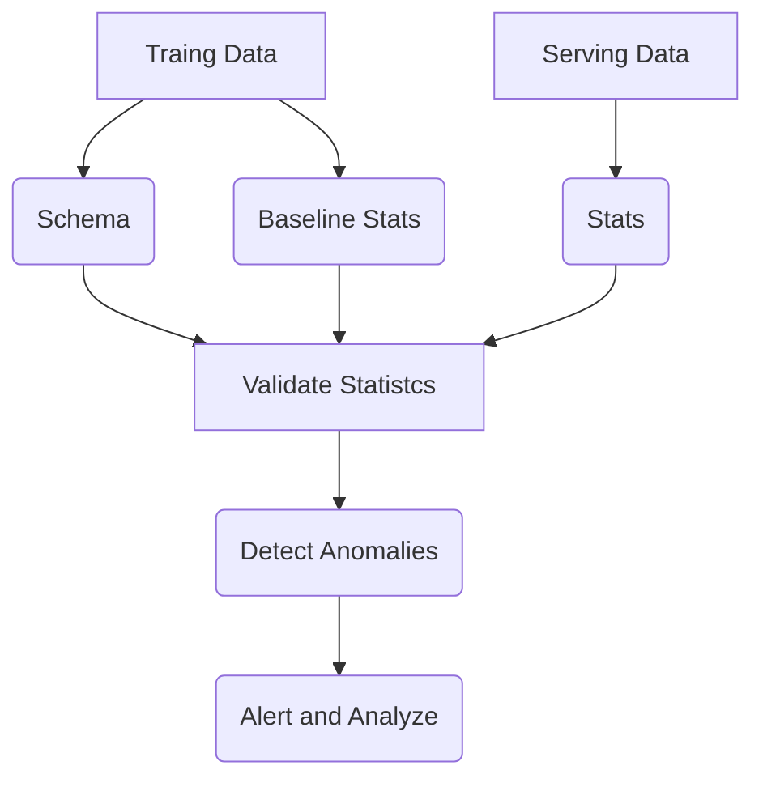

Creado: 2022-12-03 13:01
Tags: #mlops #data-lifecycle #data-validation #skew-detection
Topic: [[Week 1 Collecting, Labeling and Validating Data]]

----

```mermaid
graph TD
A[Traing Data] -->C(Baseline Stats)
B[Serving Data] --> F(Stats)
A --> D(Schema)
D -->E[Validate Statistcs]
C --> E
F --> E
E --> G(Detect Anomalies)
G --> H(Alert and Analyze)
```

## Referencias
[[Detecting Data Issues]]